# 🗺️ 30-Day AI Engineer Learning Roadmap

> A visual, comprehensive roadmap showing what you will learn, when, and how it connects.

---

## The Master Learning Arc

```
WEEK 1 — FOUNDATIONS
Python → Math → ML Fundamentals → Deep Learning Intro

WEEK 2 — INTELLIGENCE
PyTorch → NLP → Transformers → LLMs → Prompt Engineering

WEEK 3 — GENERATIVE AI
Embeddings → Vector DBs → RAG → Advanced RAG → Evaluation

WEEK 4 — PRODUCTION AI
Agents → FastAPI → Docker → LLMOps → System Design → Interview
```

---

## Visual Roadmap

```mermaid
flowchart TD
    subgraph PHASE1["Phase 1: Foundation (Days 1-3)"]
        D1[Day 1: AI Engineer Foundation]
        D2[Day 2: Python for AI]
        D3[Day 3: Python Engineering + NumPy + Pandas]
    end

    subgraph PHASE2["Phase 2: Math + Data (Days 4-6)"]
        D4[Day 4: AI Mathematics]
        D5[Day 5: Statistics + Data Analysis]
        D6[Day 6: ML Mathematics]
    end

    subgraph PHASE3["Phase 3: Machine Learning (Days 7-9)"]
        D7[Day 7: ML Fundamentals]
        D8[Day 8: ML Evaluation]
        D9[Day 9: End-to-End ML]
    end

    subgraph PHASE4["Phase 4: Deep Learning (Days 10-12)"]
        D10[Day 10: Neural Networks]
        D11[Day 11: PyTorch]
        D12[Day 12: Deep Learning Engineering]
    end

    subgraph PHASE5["Phase 5: NLP + Transformers + LLM (Days 13-15)"]
        D13[Day 13: NLP Fundamentals]
        D14[Day 14: Transformers]
        D15[Day 15: LLM Fundamentals]
    end

    subgraph PHASE6["Phase 6: GenAI Engineering (Days 16-18)"]
        D16[Day 16: Prompt Engineering]
        D17[Day 17: Embeddings]
        D18[Day 18: Vector Databases]
    end

    subgraph PHASE7["Phase 7: RAG (Days 19-22)"]
        D19[Day 19: RAG Fundamentals]
        D20[Day 20: Advanced RAG]
        D21[Day 21: Production RAG]
        D22[Day 22: RAG Evaluation]
    end

    subgraph PHASE8["Phase 8: AI Agents (Days 23-25)"]
        D23[Day 23: AI Agents]
        D24[Day 24: Tool Calling]
        D25[Day 25: Advanced Agents + MCP]
    end

    subgraph PHASE9["Phase 9: Production Engineering (Days 26-27)"]
        D26[Day 26: FastAPI AI Backend]
        D27[Day 27: Docker + Cloud]
    end

    subgraph PHASE10["Phase 10: LLMOps + System Design (Days 28-30)"]
        D28[Day 28: LLMOps + Security]
        D29[Day 29: AI System Design]
        D30[Day 30: Job Readiness]
    end

    PHASE1 --> PHASE2
    PHASE2 --> PHASE3
    PHASE3 --> PHASE4
    PHASE4 --> PHASE5
    PHASE5 --> PHASE6
    PHASE6 --> PHASE7
    PHASE7 --> PHASE8
    PHASE8 --> PHASE9
    PHASE9 --> PHASE10
```



---

## Knowledge Dependency Map

```
CORE PYTHON
    │
    ├── Type Hints ─────────────────────────── FastAPI, Pydantic
    ├── Async/Await ─────────────────────────── FastAPI, Background Workers
    ├── OOP / Dataclasses ───────────────────── ML Models, Agents
    └── Error Handling + Logging ────────────── Production Systems
         │
    NumPy + Pandas
         │
    ┌────┴────┐
    │         │
 Math      Data Engineering
    │         │
    └────┬────┘
         │
    Machine Learning (scikit-learn)
         │
    Deep Learning (PyTorch)
         │
    ┌────┴────┐
    │         │
   NLP    Computer Vision
    │
Transformers (BERT, GPT architecture)
    │
    ├── LLM APIs (OpenAI, Anthropic, Gemini)
    ├── Open-Source LLMs (Llama, Mistral)
    └── Embeddings
             │
         Vector Databases
             │
    ┌────────┴────────┐
    │                 │
   RAG             Semantic Search
    │
    ├── Advanced RAG
    ├── RAG Evaluation
    └── Production RAG
             │
    ┌────────┴────────┐
    │                 │
  Agents           LLM APIs
    │
    ├── Tool Calling
    ├── Agent Memory
    └── MCP
         │
    FastAPI Backend
         │
    Docker + Cloud
         │
    LLMOps + Observability
         │
    Production AI System
```

---

## Skills Acquisition Timeline

### Week 1: Foundation (Days 1–7)

**Day 1** — Big Picture
- Understand the AI landscape
- Know what every term means
- Understand what an AI Engineer builds

**Day 2** — Python Mastery
- Python data types, functions, OOP
- Async programming
- Type hints, JSON, file handling

**Day 3** — Data Engineering
- NumPy arrays and operations
- Pandas DataFrames
- Data cleaning and transformation

**Day 4** — Mathematics
- Vectors and matrices
- Dot products and norms
- Probability basics
- Cosine similarity (critical for embeddings)

**Day 5** — Statistics
- Distributions and sampling
- Correlation and covariance
- Feature engineering basics

**Day 6** — ML Mathematics
- Loss functions
- Gradient descent
- Regularization

**Day 7** — Machine Learning
- Supervised/unsupervised learning
- Core algorithms
- First ML API

---

### Week 2: Deep Learning + NLP (Days 8–14)

**Day 8** — ML Evaluation
- Every metric explained
- Cross-validation
- Hyperparameter tuning

**Day 9** — End-to-End ML
- Full pipeline: data → API → Docker
- Model serialization
- Production ML service

**Day 10** — Neural Networks
- Backpropagation from scratch
- Activation functions
- Loss and optimization

**Day 11** — PyTorch
- Tensors, datasets, training loops
- GPU acceleration
- Model checkpointing

**Day 12** — Deep Learning Engineering
- CNN, RNN, LSTM
- Transfer learning
- Text classification

**Day 13** — NLP
- Tokenization, embeddings
- TF-IDF, word2vec concepts
- Semantic similarity

**Day 14** — Transformers
- Full attention mechanism
- Encoder/decoder architecture
- Self-attention implementation

---

### Week 3: LLMs + GenAI + RAG (Days 15–22)

**Day 15** — LLMs
- Architecture and inference
- Context windows, sampling
- LLM APIs

**Day 16** — Prompt Engineering
- All prompting techniques
- Structured output
- JSON extraction
- Prompt injection defense

**Day 17** — Embeddings
- Semantic representations
- Cosine similarity at scale
- Embedding APIs

**Day 18** — Vector Databases
- ChromaDB, FAISS, pgvector
- Indexing and retrieval
- Metadata filtering

**Day 19** — RAG Fundamentals
- Complete RAG pipeline
- Chunking strategies
- Basic RAG chatbot

**Day 20** — Advanced RAG
- Hybrid search (BM25 + semantic)
- Reranking
- Query rewriting

**Day 21** — Production RAG
- Async ingestion pipeline
- Caching and retries
- Observability

**Day 22** — RAG Evaluation
- RAGAS framework
- Faithfulness and relevance
- Evaluation datasets

---

### Week 4: Agents + Production + Job (Days 23–30)

**Day 23** — AI Agents
- ReAct pattern
- Planning and reasoning
- Agent memory

**Day 24** — Tool Calling
- Function calling API
- Tool schemas
- Error handling in agents

**Day 25** — Advanced Agents + MCP
- Multi-agent systems
- Model Context Protocol
- Agent security

**Day 26** — FastAPI
- Production AI API
- Streaming responses
- Authentication

**Day 27** — Docker + Cloud
- Containerization
- Docker Compose
- CI/CD basics

**Day 28** — LLMOps + Security
- Full observability stack
- Guardrails
- PII protection

**Day 29** — System Design
- Enterprise AI architecture
- Final major project

**Day 30** — Job Readiness
- 250+ interview questions
- Mock interviews
- Resume and portfolio

---

## Technology Stack Progression

```
Day 1-3:   Python, pip, venv, JSON, logging
Day 4-6:   NumPy, Pandas, matplotlib
Day 7-9:   scikit-learn, joblib, FastAPI (basic)
Day 10-12: PyTorch, torchvision, CUDA
Day 13-15: HuggingFace Transformers, tokenizers, LLM APIs
Day 16-18: OpenAI SDK, Anthropic SDK, ChromaDB, FAISS
Day 19-22: LangChain concepts, RAGAS, pgvector, PostgreSQL
Day 23-25: Tool calling, MCP, multi-agent frameworks
Day 26-27: FastAPI (advanced), Pydantic v2, Docker, Redis
Day 28-30: Prometheus, Grafana concepts, structlog, pytest
```

---

## Interview Preparation Timeline

| Week | Focus |
|------|-------|
| Week 1 | Python, NumPy, Pandas, ML basics |
| Week 2 | Deep Learning, PyTorch, Transformers |
| Week 3 | LLMs, RAG, Vector DBs, Embeddings |
| Week 4 | Agents, FastAPI, Docker, System Design |
| Day 30 | Full mock interview across all topics |

---

## Project Milestones

```
Day 9  → PROJECT 1: ML Prediction System (scikit-learn + FastAPI + Docker)
Day 17 → PROJECT 2: Semantic Search Engine (Embeddings + FAISS + FastAPI)
Day 22 → PROJECT 3: Enterprise RAG Assistant (Full RAG stack)
Day 25 → PROJECT 4: AI Research Agent (Agents + Tools + Memory)
Day 29 → PROJECT 5: Enterprise AI Knowledge Assistant (Complete system)
```

---

## Critical Concept Connections

These connections MUST be understood deeply:

### Connection 1: Token → Embedding → Similarity
```
Text → Tokenizer → Token IDs → Embedding Model → Vectors → Cosine Similarity
```

### Connection 2: Embedding → Vector DB → RAG
```
Document → Chunk → Embed → Store in Vector DB → Query → Retrieve → Context → LLM
```

### Connection 3: Python Class → Pydantic → FastAPI → API
```
Data Class → Pydantic Model → FastAPI endpoint → REST API → Docker
```

### Connection 4: ML Model → Evaluation → Production
```
Train → Evaluate (metrics) → Serialize → FastAPI → Docker → Monitor
```

### Connection 5: Agent → Tools → Memory → MCP
```
User Query → Agent Plan → Tool Selection → Tool Execution → Memory → Response
```

---

## What You Can Build After Each Phase

| After Phase | You Can Build |
|-------------|--------------|
| Phase 1 (Day 3) | Python CLI tools, data processors |
| Phase 2 (Day 6) | Mathematical simulations, calculators |
| Phase 3 (Day 9) | ML prediction APIs, classification services |
| Phase 4 (Day 12) | Text/image classifiers, custom models |
| Phase 5 (Day 15) | LLM-powered chatbots, text processors |
| Phase 6 (Day 18) | Semantic search engines, document finders |
| Phase 7 (Day 22) | Production RAG systems, knowledge assistants |
| Phase 8 (Day 25) | AI research agents, autonomous assistants |
| Phase 9 (Day 27) | Dockerized AI backends, production APIs |
| Phase 10 (Day 30) | Complete enterprise AI systems |

---

## The Final System You Must Be Able to Build

```
┌─────────────────────────────────────────────────────────────────┐
│                  ENTERPRISE AI KNOWLEDGE ASSISTANT               │
├─────────────────────────────────────────────────────────────────┤
│                                                                   │
│  User Query                                                       │
│      ↓                                                            │
│  [API Gateway] → Rate Limiting → Authentication                  │
│      ↓                                                            │
│  [FastAPI Backend]                                                │
│      ↓                                                            │
│  [AI Orchestrator]                                                │
│      ↓                                                            │
│  ┌─────────────────────────────┐                                 │
│  │       RAG Pipeline          │                                 │
│  │  Query → Embed → Search    │                                 │
│  │  → Rerank → Context        │                                 │
│  └──────────┬──────────────────┘                                 │
│             │                                                     │
│  ┌──────────┴──────────────────┐                                 │
│  │       Agent System          │                                 │
│  │  Plan → Tools → Execute    │                                 │
│  └──────────┬──────────────────┘                                 │
│             │                                                     │
│  [LLM] ← Context + Query                                         │
│      ↓                                                            │
│  [Response] → Evaluation → Guardrails                           │
│      ↓                                                            │
│  [Observability] → Logs → Metrics → Traces                      │
│                                                                   │
│  Infrastructure:                                                  │
│  PostgreSQL | Redis | ChromaDB | Docker | CI/CD                  │
│                                                                   │
└─────────────────────────────────────────────────────────────────┘
```

---

## How to Use This Roadmap

1. **Read this roadmap before each phase** to understand context
2. **Connect each day** to where it fits in the larger picture
3. **Never skip foundation** — Day 1-3 sets everything up
4. **Build, don't just read** — Every day has runnable code
5. **Interview prep is daily** — Do the questions every day
6. **Track progress** in `progress.md`

---

*This roadmap is your compass. The days are your steps. The job is the destination.*
